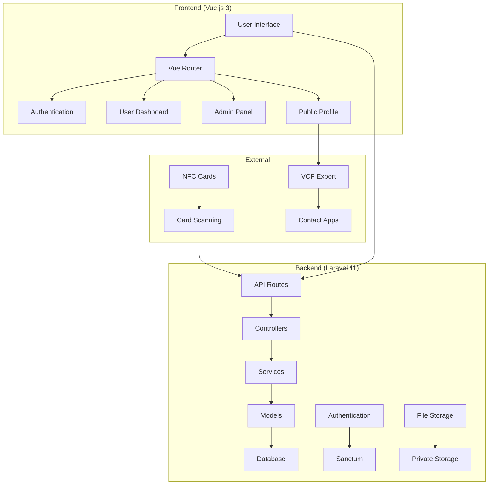
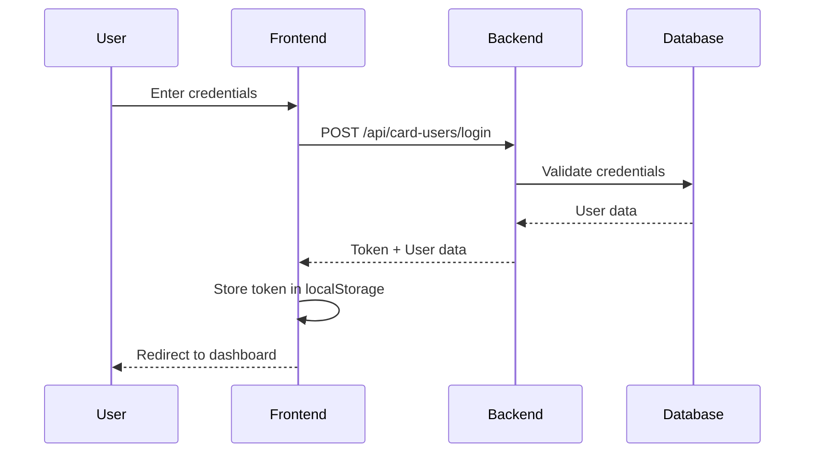
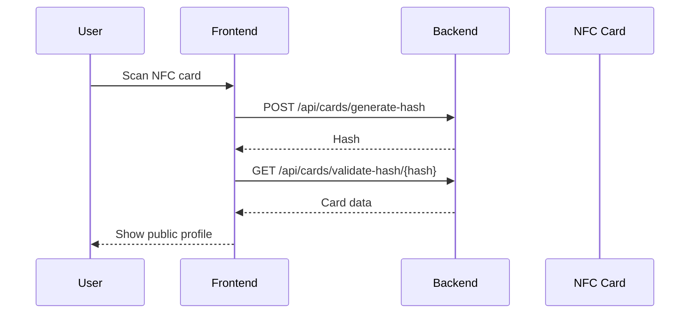
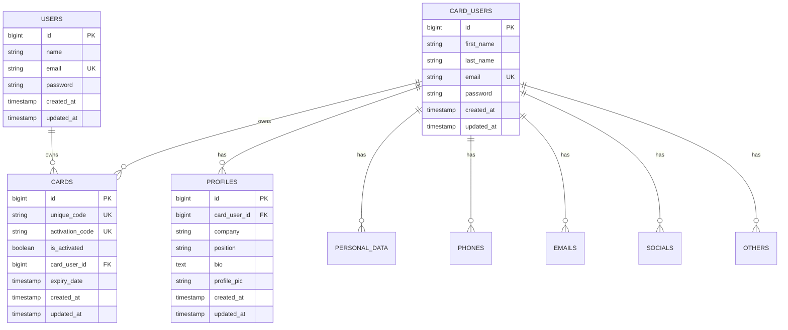

# GoTapMode v2 - Digital Business Card Platform

<div align="center">


**Instant Digital Business Card Sharing via NFC Technology**

[](https://laravel.com)
[](https://vuejs.org)
[](https://tailwindcss.com)
[](https://php.net)

</div>

## 📋 Table of Contents

- [Overview](#overview)
- [Architecture](#architecture)
- [Features](#features)
- [Technology Stack](#technology-stack)
- [Project Structure](#project-structure)
- [Backend Documentation](#backend-documentation)
- [Frontend Documentation](#frontend-documentation)
- [Installation & Setup](#installation--setup)
- [API Documentation](#api-documentation)
- [Database Schema](#database-schema)
- [Deployment](#deployment)
- [Contributing](#contributing)
- [License](#license)

## 🎯 Overview

GoTapMode is a revolutionary digital business card platform that leverages NFC (Near Field Communication) technology to enable instant contact sharing. Users can create digital profiles, upload photos, manage contact information, and share their details by simply tapping an NFC-enabled device to their business card.

### Key Benefits
- **Instant Sharing**: Tap to share contact information instantly
- **Rich Profiles**: Photos, social links, company information, and more
- **VCF Export**: Save contacts directly to phone's contact list
- **Admin Dashboard**: Comprehensive user and card management
- **Analytics**: Track card views and engagement
- **Mobile Optimized**: Works seamlessly on all devices

## 🏗️ Architecture



## ✨ Features

### 🔐 Authentication & User Management
- **Dual Authentication System**: Separate auth for users and admins
- **Secure Token-based Auth**: Laravel Sanctum for API authentication
- **Profile Management**: Complete user profile setup and editing
- **Photo Upload**: Secure profile picture management with private storage

### 📱 NFC Card Integration
- **Card Activation**: Link NFC cards to user accounts
- **Hash-based Security**: Secure card validation using HMAC
- **Public Profile Access**: View profiles by scanning NFC cards
- **Card Management**: Admin tools for card issuance and tracking

### 📊 Admin Dashboard
- **User Management**: View, edit, and manage all users
- **Card Analytics**: Track card views and user engagement
- **Administrator Management**: Manage admin accounts
- **NFC Writing Tools**: Write data to NFC cards
- **Statistics Dashboard**: Real-time analytics and insights

### 📞 Contact Management
- **Multiple Contact Types**: Phone, email, social media, websites
- **Main Contact Selection**: Set primary contact methods
- **VCF Export**: Download contacts as VCF files with photos
- **Public Contact Sharing**: Share contact info via NFC

### 🎨 User Interface
- **Responsive Design**: Works on all device sizes
- **Modern UI**: Clean, professional interface with Tailwind CSS
- **Dark/Light Themes**: User preference support
- **Progressive Web App**: Offline capabilities and app-like experience

## 🛠️ Technology Stack

### Backend
- **Framework**: Laravel 11.x
- **PHP Version**: 8.3
- **Authentication**: Laravel Sanctum
- **Database**: MySQL/PostgreSQL
- **File Storage**: Laravel Storage (Private)
- **API**: RESTful API with rate limiting
- **Testing**: Pest PHP

### Frontend
- **Framework**: Vue.js 3 (Composition API)
- **Build Tool**: Vite
- **Styling**: Tailwind CSS
- **HTTP Client**: Axios
- **Routing**: Vue Router 4
- **Charts**: ApexCharts
- **Icons**: Custom icon set

### Development Tools
- **Package Manager**: Composer (Backend), npm (Frontend)
- **Code Quality**: Laravel Pint, ESLint
- **Version Control**: Git
- **Deployment**: Custom deployment scripts

## 📁 Project Structure

```
Gotapmodev2/
├── Backend/                    # Laravel API Backend
│   ├── app/
│   │   ├── Http/Controllers/   # API Controllers
│   │   ├── Models/            # Eloquent Models
│   │   ├── Services/          # Business Logic Services
│   │   └── Helpers/           # Helper Functions
│   ├── config/                # Configuration Files
│   ├── database/
│   │   ├── migrations/        # Database Migrations
│   │   └── seeders/          # Database Seeders
│   ├── routes/
│   │   └── api.php           # API Routes
│   └── storage/              # File Storage
├── frontend/                  # Vue.js Frontend
│   ├── src/
│   │   ├── admin/            # Admin Panel Components
│   │   ├── user/             # User Interface Components
│   │   ├── components/       # Shared Components
│   │   ├── config/           # Configuration
│   │   ├── router/           # Vue Router
│   │   └── utils/            # Utility Functions
│   ├── public/               # Static Assets
│   └── dist/                 # Built Assets
├── ptm-transportation/        # Transportation Module
├── ptm-transportrequest/      # Transport Request Module
└── start_*.bat               # Development Scripts
```

---

## 🔧 Backend Documentation

### Core Components

#### Models
- **CardUser**: Regular users with NFC cards
- **User**: Admin users
- **Card**: NFC card management
- **Profile**: User profile information
- **PersonalData**: Personal information
- **Contact**: Contact information (phones, emails, socials)

#### Services
- **CardService**: NFC card business logic
- **AdminService**: Admin dashboard statistics
- **CardUserService**: User management logic

#### Controllers
- **CardUserController**: User authentication and profile management
- **CardActivationController**: NFC card activation and validation
- **CardUserPhotoController**: Profile photo management
- **ContactsController**: Contact information management
- **AdminAuthController**: Admin authentication
- **AdminUserController**: Admin user management

### API Endpoints

#### Authentication
```
POST /api/card-users/register     # User registration
POST /api/card-users/login        # User login
POST /api/card-users/logout       # User logout
GET  /api/card-users/me           # Get current user
```

#### Card Management
```
POST /api/cards/generate-hash     # Generate card hash
GET  /api/cards/validate-hash/{hash} # Validate card hash
POST /api/cards/activate          # Activate card
GET  /api/cards/{unique_code}     # Get card by unique code
```

#### Profile Management
```
POST /api/card-users/profile      # Update profile
POST /api/card-users/personal-data # Update personal data
POST /api/card-users/complete-profile # Update complete profile
POST /api/card-users/profile/picture # Upload profile photo
```

#### Contact Management
```
GET  /api/contacts/{userId}       # Get public contacts
POST /api/contacts/phones         # Add phone number
POST /api/contacts/emails         # Add email
POST /api/contacts/socials        # Add social media
POST /api/contacts/others         # Add other links
```

#### Admin Endpoints
```
POST /api/admin/login             # Admin login
GET  /api/admin/stats             # Dashboard statistics
GET  /api/admin/users             # List users
POST /api/admin/users/{id}/profile/picture # Upload user photo
```

### Database Schema

#### Users Table
```sql
CREATE TABLE users (
    id BIGINT PRIMARY KEY,
    name VARCHAR(255),
    email VARCHAR(255) UNIQUE,
    password VARCHAR(255),
    created_at TIMESTAMP,
    updated_at TIMESTAMP
);
```

#### Card Users Table
```sql
CREATE TABLE card_users (
    id BIGINT PRIMARY KEY,
    first_name VARCHAR(255),
    last_name VARCHAR(255),
    email VARCHAR(255) UNIQUE,
    password VARCHAR(255),
    created_at TIMESTAMP,
    updated_at TIMESTAMP
);
```

#### Cards Table
```sql
CREATE TABLE cards (
    id BIGINT PRIMARY KEY,
    unique_code VARCHAR(255) UNIQUE,
    activation_code VARCHAR(255) UNIQUE,
    is_activated BOOLEAN DEFAULT FALSE,
    card_user_id BIGINT,
    expiry_date TIMESTAMP NULL,
    created_at TIMESTAMP,
    updated_at TIMESTAMP
);
```

#### Profiles Table
```sql
CREATE TABLE profiles (
    id BIGINT PRIMARY KEY,
    card_user_id BIGINT,
    company VARCHAR(255),
    position VARCHAR(255),
    bio TEXT,
    profile_pic VARCHAR(255),
    created_at TIMESTAMP,
    updated_at TIMESTAMP
);
```

### Security Features

#### Rate Limiting
- **Public Routes**: 100 requests/minute
- **User Routes**: 200 requests/minute
- **Admin Routes**: 500 requests/minute
- **Card Scan Routes**: 10 requests/minute
- **Image Routes**: 50 requests/minute

#### Authentication
- **Laravel Sanctum**: Token-based authentication
- **Password Hashing**: bcrypt encryption
- **CORS Protection**: Configured for frontend domains
- **Input Validation**: Comprehensive request validation

#### File Storage
- **Private Storage**: Profile photos stored securely
- **Image Serving**: Secure image serving with authentication
- **File Validation**: Image type and size validation

---

## 🎨 Frontend Documentation

### Component Architecture

#### User Components
- **UserLogin**: User authentication
- **Signup**: User registration
- **UserDashboard**: Main user interface
- **ProfileDetails**: Profile setup
- **EditProfile**: Profile editing
- **ProfilePhoto**: Photo upload
- **PublicProfile**: Public profile view
- **CardValidation**: NFC card validation

#### Admin Components
- **Dashboard**: Admin statistics dashboard
- **Users**: User management interface
- **EditUser**: User editing interface
- **NFCCards**: Card management
- **Administrators**: Admin user management
- **NFCWriting**: NFC card writing tools

### Routing

#### User Routes
```javascript
/                    # Login page
/signup             # Registration
/activate           # Card activation
/card-validation    # NFC card validation
/dashboard          # User dashboard
/profile-details    # Profile setup
/edit-profile       # Profile editing
/profile/photo      # Photo upload
/p/:code           # Public profile
```

#### Admin Routes
```javascript
/admin/dashboard           # Admin dashboard
/admin/users              # User management
/admin/users/:id/edit     # Edit user
/admin/administrators     # Admin management
/admin/nfc-writing        # NFC writing
/admin/nfc-cards          # Card management
```

### State Management

#### Authentication State
```javascript
// User authentication
localStorage.getItem('gtm_token')
localStorage.getItem('gtm_user')

// Admin authentication
localStorage.getItem('gtm_admin_token')
localStorage.getItem('gtm_admin_user')
```

#### API Configuration
```javascript
// API base URLs
const BACKEND_BASE = 'https://api.gotapmode.info'
const FRONTEND_BASE = 'https://www.gotapmode.info'

// Axios configuration
const api = axios.create({
  baseURL: BACKEND_BASE + '/api',
  headers: {
    'Content-Type': 'application/json',
    'Accept': 'application/json'
  }
})
```

### Key Features

#### NFC Integration
- **Card Scanning**: Automatic NFC card detection
- **Hash Generation**: Secure card validation
- **Public Profile**: Instant profile sharing

#### VCF Export
- **Contact Download**: Save contacts as VCF files
- **Photo Inclusion**: Profile photos in VCF files
- **Multiple Formats**: Support for various contact apps

#### Responsive Design
- **Mobile First**: Optimized for mobile devices
- **Tailwind CSS**: Utility-first styling
- **Dark Mode**: Theme support
- **Progressive Web App**: App-like experience

### Utility Functions

#### Image Processing
```javascript
// Process profile images
processProfileImage(imageUrl)

// Convert image to base64
imageUrlToBase64(url)
```

#### SEO Management
```javascript
// Update page title
updatePageTitle(title)

// Update meta description
updateMetaDescription(description)

// Update Open Graph tags
updateOpenGraphTags(data)
```

---

## 🚀 Installation & Setup

### Prerequisites
- PHP 8.3+
- Composer
- Node.js 18+
- MySQL/PostgreSQL
- Git

### Backend Setup

1. **Clone Repository**
```bash
git clone <repository-url>
cd Gotapmodev2/Backend
```

2. **Install Dependencies**
```bash
composer install
```

3. **Environment Configuration**
```bash
cp .env.example .env
php artisan key:generate
```

4. **Database Setup**
```bash
# Configure database in .env
DB_CONNECTION=mysql
DB_HOST=127.0.0.1
DB_PORT=3306
DB_DATABASE=gotapmode
DB_USERNAME=root
DB_PASSWORD=

# Run migrations
php artisan migrate
php artisan db:seed
```

5. **Storage Setup**
```bash
php artisan storage:link
chmod -R 775 storage
```

6. **Start Development Server**
```bash
php artisan serve
```

### Frontend Setup

1. **Navigate to Frontend**
```bash
cd ../frontend
```

2. **Install Dependencies**
```bash
npm install
```

3. **Environment Configuration**
```bash
# Update API configuration in src/config/api.js
const BACKEND_BASE = 'http://localhost:8000'
const FRONTEND_BASE = 'http://localhost:5173'
```

4. **Start Development Server**
```bash
npm run dev
```

### Quick Start Scripts

#### Windows
```bash
# Start both frontend and backend
start_both.bat

# Start only backend
start_backend.bat

# Start only frontend
start_frontend.bat
```

#### Manual Start
```bash
# Terminal 1 - Backend
cd Backend
php artisan serve

# Terminal 2 - Frontend
cd frontend
npm run dev
```

---

## 📊 API Documentation

### Authentication Flow



### Card Activation Flow



### Rate Limiting

| Route Type | Limit | Window |
|------------|-------|--------|
| Public | 100 req/min | 1 minute |
| User | 200 req/min | 1 minute |
| Admin | 500 req/min | 1 minute |
| Card Scan | 10 req/min | 1 minute |
| Image | 50 req/min | 1 minute |

---

## 🗄️ Database Schema

### Entity Relationship Diagram



---

## 🚀 Deployment

### Production Environment

#### Backend Deployment
1. **Server Requirements**
   - PHP 8.3+
   - MySQL/PostgreSQL
   - Nginx/Apache
   - SSL Certificate

2. **Laravel Configuration**
```bash
# Set production environment
APP_ENV=production
APP_DEBUG=false

# Configure database
DB_CONNECTION=mysql
DB_HOST=your-db-host
DB_DATABASE=gotapmode_prod
DB_USERNAME=your-username
DB_PASSWORD=your-password

# Configure storage
FILESYSTEM_DISK=local
```

3. **Deployment Steps**
```bash
# Install dependencies
composer install --optimize-autoloader --no-dev

# Run migrations
php artisan migrate --force

# Cache configuration
php artisan config:cache
php artisan route:cache
php artisan view:cache

# Set permissions
chmod -R 755 storage bootstrap/cache
```

#### Frontend Deployment
1. **Build for Production**
```bash
npm run build
```

2. **Deploy to Web Server**
   - Upload `dist/` contents to web server
   - Configure Nginx/Apache for SPA routing
   - Set up SSL certificate

### Environment Variables

#### Backend (.env)
```env
APP_NAME="GoTapMode"
APP_ENV=production
APP_KEY=base64:your-app-key
APP_DEBUG=false
APP_URL=https://api.gotapmode.info

DB_CONNECTION=mysql
DB_HOST=localhost
DB_PORT=3306
DB_DATABASE=gotapmode
DB_USERNAME=username
DB_PASSWORD=password

SANCTUM_STATEFUL_DOMAINS=www.gotapmode.info
SESSION_DOMAIN=.gotapmode.info
```

#### Frontend (config)
```javascript
const BACKEND_BASE = 'https://api.gotapmode.info'
const FRONTEND_BASE = 'https://www.gotapmode.info'
```

---

## 🧪 Testing

### Backend Testing
```bash
cd Backend
php artisan test
```

### Frontend Testing
```bash
cd frontend
npm run test
```

### Test Coverage
- **Unit Tests**: Model and service testing
- **Feature Tests**: API endpoint testing
- **Integration Tests**: Full workflow testing

---

## 📈 Performance Optimization

### Backend Optimizations
- **Database Queries**: Optimized with Eloquent relationships
- **Caching**: Route and config caching
- **Rate Limiting**: Prevents abuse
- **Image Optimization**: Compressed profile photos

### Frontend Optimizations
- **Code Splitting**: Lazy loading of components
- **Image Optimization**: WebP format support
- **Caching**: Service worker implementation
- **Bundle Size**: Tree shaking and minification

---

## 🔒 Security

### Backend Security
- **Input Validation**: Comprehensive request validation
- **SQL Injection**: Eloquent ORM protection
- **XSS Protection**: Output escaping
- **CSRF Protection**: Token validation
- **Rate Limiting**: API abuse prevention

### Frontend Security
- **XSS Prevention**: Vue.js built-in protection
- **HTTPS Only**: Secure communication
- **Content Security Policy**: Restricted resource loading
- **Token Storage**: Secure localStorage usage

---

## 🤝 Contributing

### Development Workflow
1. Fork the repository
2. Create a feature branch
3. Make your changes
4. Add tests for new features
5. Submit a pull request

### Code Standards
- **PHP**: PSR-12 coding standard
- **JavaScript**: ESLint configuration
- **Vue.js**: Composition API preferred
- **CSS**: Tailwind CSS utility classes

### Commit Convention
```
feat: add new feature
fix: bug fix
docs: documentation update
style: code formatting
refactor: code refactoring
test: add tests
chore: maintenance tasks
```

---

## 📄 License

This project is licensed under the MIT License - see the [LICENSE](LICENSE) file for details.

---

## 📞 Support

For support and questions:
- **Email**: support@gotapmode.info
- **Documentation**: [docs.gotapmode.info](https://docs.gotapmode.info)
- **Issues**: [GitHub Issues](https://github.com/your-repo/issues)

---

<div align="center">

**Built with ❤️ by the GoTapMode Team**

[Website](https://gotapmode.info) • [Documentation](https://docs.gotapmode.info) • [Support](mailto:support@gotapmode.info)

</div>
