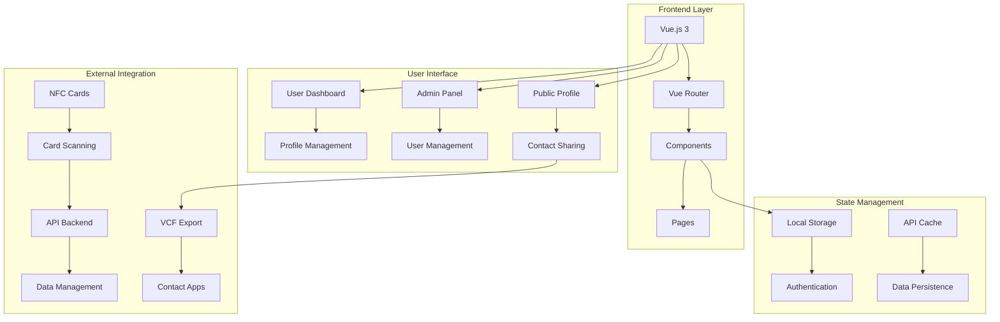

# GoTapMode Frontend

<div align="center">


[](https://tailwindcss.com)
[](https://vitejs.dev)
[](https://axios-http.com)

**Vue.js 3 Frontend for Digital Business Card Platform**

</div>

## 📋 Table of Contents

- [Overview](#overview)
- [Architecture](#architecture)
- [Technology Stack](#technology-stack)
- [Component Structure](#component-structure)
- [Routing](#routing)
- [State Management](#state-management)
- [API Integration](#api-integration)
- [NFC Integration](#nfc-integration)
- [VCF Export](#vcf-export)
- [Installation](#installation)
- [Configuration](#configuration)
- [Development](#development)
- [Building](#building)
- [Deployment](#deployment)

## 🎯 Overview

The GoTapMode Frontend is a modern Vue.js 3 application that provides an intuitive interface for digital business card management. It features NFC integration, profile management, contact sharing, and VCF export capabilities.

### Key Features
- **Modern UI**: Clean, responsive design with Tailwind CSS
- **NFC Integration**: Tap-to-share functionality
- **Profile Management**: Complete user profile setup and editing
- **Contact Sharing**: VCF export with photos
- **Admin Dashboard**: Comprehensive admin interface
- **Mobile Optimized**: Progressive Web App capabilities
- **Real-time Updates**: Dynamic data loading

## 🏗️ Architecture



## 🛠️ Technology Stack

### Core Framework
- **Vue.js 3**: Progressive JavaScript framework
- **Composition API**: Modern Vue.js development approach
- **Vue Router 4**: Client-side routing
- **Vite**: Fast build tool and dev server

### Styling & UI
- **Tailwind CSS**: Utility-first CSS framework
- **Custom Components**: Reusable Vue components
- **Responsive Design**: Mobile-first approach
- **Dark Mode**: Theme support

### HTTP & API
- **Axios**: HTTP client for API communication
- **API Configuration**: Centralized API management
- **Error Handling**: Comprehensive error management
- **Request Interceptors**: Automatic token handling

### Charts & Visualization
- **ApexCharts**: Interactive charts for admin dashboard
- **Vue3-ApexCharts**: Vue.js integration for ApexCharts

### Development Tools
- **Node.js**: JavaScript runtime
- **npm**: Package manager
- **PostCSS**: CSS processing
- **Autoprefixer**: CSS vendor prefixing

## 📁 Component Structure

### User Components
```
src/user/
├── UserLogin.vue          # User authentication
├── Signup.vue             # User registration
├── UserDashboard.vue      # Main user interface
├── ProfileDetails.vue     # Profile setup
├── EditProfile.vue        # Profile editing
├── ProfilePhoto.vue       # Photo upload
├── PublicProfile.vue      # Public profile view
├── CardValidation.vue     # NFC card validation
└── Activate.vue           # Card activation
```

### Admin Components
```
src/admin/
├── Dashboard.vue          # Admin statistics dashboard
├── Users.vue              # User management
├── EditUser.vue           # User editing interface
├── NFCCards.vue           # Card management
├── Administrators.vue     # Admin user management
├── NFCWriting.vue         # NFC writing tools
└── CardClear.vue          # Card clearing tools
```

### Shared Components
```
src/components/
└── SharedComponent.vue    # Reusable components
```

### Utilities
```
src/utils/
├── seo.js                 # SEO management
├── imageUtils.js          # Image processing
└── api.js                 # API utilities
```

## 🛣️ Routing

### User Routes
```javascript
const routes = [
  { path: '/', name: 'login', component: Login },
  { path: '/signup', name: 'signup', component: Signup },
  { path: '/activate', name: 'activate', component: Activate },
  { path: '/card-validation', name: 'card-validation', component: CardValidation },
  { path: '/:activationCode', name: 'nfc-card', component: CardValidation },
  { path: '/profile-setup', name: 'profile-setup', component: ProfileSetup, meta: { requiresUser: true } },
  { path: '/profile-details', name: 'profile-details', component: ProfileDetails, meta: { requiresUser: true } },
  { path: '/dashboard', name: 'dashboard', component: UserDashboard, meta: { requiresUser: true } },
  { path: '/edit-profile', name: 'edit-profile', component: EditProfile, meta: { requiresUser: true } },
  { path: '/profile/photo', name: 'profile-photo', component: ProfilePhoto, meta: { requiresUser: true } },
  { path: '/p/:code', name: 'public-profile', component: PublicProfile },
]
```

### Admin Routes
```javascript
const adminRoutes = [
  { path: '/admin/dashboard', name: 'admin-dashboard', component: AdminDashboard, meta: { requiresAdmin: true } },
  { path: '/admin/users', name: 'admin-users', component: AdminUsers, meta: { requiresAdmin: true } },
  { path: '/admin/users/:id/edit', name: 'admin-edit-user', component: EditUser, meta: { requiresAdmin: true } },
  { path: '/admin/administrators', name: 'admin-administrators', component: Administrators, meta: { requiresAdmin: true } },
  { path: '/admin/nfc-writing', name: 'admin-nfc-writing', component: NfcWriting, meta: { requiresAdmin: true } },
  { path: '/admin/card-clear', name: 'admin-card-clear', component: CardClear, meta: { requiresAdmin: true } },
  { path: '/admin/nfc-cards', name: 'admin-nfc-cards', component: NFCCards, meta: { requiresAdmin: true } },
]
```

### Route Guards
```javascript
router.beforeEach((to, from, next) => {
  // Admin route protection
  if (to.meta?.requiresAdmin) {
    const token = localStorage.getItem('gtm_admin_token')
    const user = JSON.parse(localStorage.getItem('gtm_admin_user') || 'null')
    if (!token || !user) {
      return next({ name: 'login', query: { redirect: to.fullPath } })
    }
  }
  
  // User route protection
  if (to.meta?.requiresUser) {
    const token = localStorage.getItem('gtm_token')
    const user = JSON.parse(localStorage.getItem('gtm_user') || 'null')
    if (!token || !user) {
      return next({ name: 'login', query: { redirect: to.fullPath } })
    }
  }
  
  next()
})
```

## 🔄 State Management

### Authentication State
```javascript
// User authentication
const userToken = localStorage.getItem('gtm_token')
const userData = JSON.parse(localStorage.getItem('gtm_user') || '{}')

// Admin authentication
const adminToken = localStorage.getItem('gtm_admin_token')
const adminData = JSON.parse(localStorage.getItem('gtm_admin_user') || '{}')
```

### API Configuration
```javascript
// src/config/api.js
const BACKEND_BASE = 'https://api.gotapmode.info'
const FRONTEND_BASE = 'https://www.gotapmode.info'

const api = axios.create({
  baseURL: BACKEND_BASE + '/api',
  headers: {
    'Content-Type': 'application/json',
    'Accept': 'application/json'
  }
})

// Request interceptor for authentication
api.interceptors.request.use((config) => {
  const token = localStorage.getItem('gtm_token')
  if (token) {
    config.headers.Authorization = `Bearer ${token}`
  }
  return config
})
```

### Data Persistence
```javascript
// Local storage management
const saveUserData = (user, token) => {
  localStorage.setItem('gtm_user', JSON.stringify(user))
  localStorage.setItem('gtm_token', token)
}

const clearUserData = () => {
  localStorage.removeItem('gtm_user')
  localStorage.removeItem('gtm_token')
}
```

## 🔌 API Integration

### User API
```javascript
// User authentication
const userApi = {
  login: (credentials) => api.post('/card-users/login', credentials),
  register: (userData) => api.post('/card-users/register', userData),
  logout: () => api.post('/card-users/logout'),
  getMe: () => api.get('/card-users/me'),
  
  // Profile management
  updateProfile: (profileData) => api.post('/card-users/profile', profileData),
  updatePersonalData: (personalData) => api.post('/card-users/personal-data', personalData),
  updateCompleteProfile: (completeData) => api.post('/card-users/complete-profile', completeData),
  getProfile: () => api.get('/card-users/profile'),
  getPersonalData: () => api.get('/card-users/personal-data'),
  
  // Photo management
  uploadPhoto: (photo) => {
    const formData = new FormData()
    formData.append('photo', photo)
    return api.post('/card-users/profile/picture', formData, {
      headers: { 'Content-Type': 'multipart/form-data' }
    })
  }
}
```

### Contact API
```javascript
// Contact management
const contactApi = {
  getContacts: () => api.get('/contacts/'),
  addPhone: (phoneData) => api.post('/contacts/phones', phoneData),
  addEmail: (emailData) => api.post('/contacts/emails', emailData),
  addSocial: (socialData) => api.post('/contacts/socials', socialData),
  addOther: (otherData) => api.post('/contacts/others', otherData),
  deleteContact: (table, id) => api.delete(`/contacts/${table}/${id}`),
  setMainPhone: (id) => api.post(`/contacts/phones/${id}/set-main`),
  setMainEmail: (id) => api.post(`/contacts/emails/${id}/set-main`),
  setMainSocial: (id) => api.post(`/contacts/socials/${id}/set-main`),
  setMainOther: (id) => api.post(`/contacts/others/${id}/set-main`)
}
```

### Admin API
```javascript
// Admin management
const adminApi = {
  login: (credentials) => api.post('/admin/login', credentials),
  logout: () => api.post('/admin/logout'),
  getMe: () => api.get('/admin/me'),
  
  // Dashboard
  getStats: () => api.get('/admin/stats'),
  
  // User management
  getUsers: () => api.get('/admin/users'),
  getUser: (id) => api.get(`/admin/users/${id}`),
  updateUser: (id, userData) => api.put(`/admin/users/${id}`, userData),
  deleteUser: (id) => api.delete(`/admin/users/${id}`),
  restoreUser: (id) => api.post(`/admin/users/${id}/restore`),
  
  // Card management
  createCard: (cardData) => api.post('/admin/cards', cardData),
  getCards: () => api.get('/admin/cards'),
  deleteCard: (id) => api.delete(`/admin/cards/${id}`)
}
```

## 📱 NFC Integration

### NFC Card Scanning
```javascript
// Card validation and scanning
const startNfcScan = async () => {
  if (!nfcSupported.value || !nfcEnabled.value) {
    error.value = 'NFC is not available on this device'
    return
  }

  try {
    const ndef = new NDEFReader()
    await ndef.scan()

    ndef.addEventListener('reading', async ({ message, serialNumber }) => {
      await readCardData(message)
    })

    ndef.addEventListener('readingerror', () => {
      error.value = 'Error reading NFC card. Please try again.'
    })

    // Timeout after 15 seconds
    setTimeout(() => {
      if (loading.value) {
        error.value = 'No card detected. Please tap your card near the device.'
        loading.value = false
      }
    }, 15000)

  } catch (err) {
    if (err.name === 'NotAllowedError') {
      error.value = 'NFC permission denied. Please enable NFC and try again.'
    } else {
      error.value = 'Failed to start NFC scanning: ' + err.message
    }
    loading.value = false
  }
}
```

### Card Data Processing
```javascript
// Process NFC card data
const readCardData = async (message) => {
  try {
    let activationCode = null
    
    // Read the URL from the NDEF message
    for (const record of message.records) {
      if (record.recordType === 'url') {
        const url = new TextDecoder().decode(record.data)
        
        // Extract activation code from URL
        if (url.startsWith(FRONTEND_BASE)) {
          activationCode = url.replace(FRONTEND_BASE + '/', '')
        } else {
          const urlParts = url.split('/')
          activationCode = urlParts[urlParts.length - 1]
        }
        break
      }
    }

    if (!activationCode) {
      error.value = 'No valid URL found on card'
      return
    }

    // Generate hash and redirect
    await generateHashAndRedirect(activationCode)

  } catch (err) {
    error.value = 'Failed to read card data: ' + (err.message || 'Unknown error')
  }
}
```

### Hash Generation and Validation
```javascript
// Generate hash for card access
const generateHashAndRedirect = async (activationCode) => {
  try {
    const response = await api.post('/cards/generate-hash', {
      activation_code: activationCode
    })

    // Redirect to public profile with hash
    router.push({ 
      name: 'public-profile', 
      params: { code: response.hash }
    })

  } catch (err) {
    if (err.response?.status === 404) {
      error.value = 'Card is not valid. This card is not registered in our system.'
    } else if (err.response?.status === 403) {
      error.value = err.response.data.message || 'Card validation failed.'
    } else {
      error.value = 'Failed to validate card: ' + (err.message || 'Unknown error')
    }
  }
}
```

## 📄 VCF Export

### VCF Generation
```javascript
// Generate VCF contact file
const generateVCF = (profile, contacts) => {
  const fullName = profile.name || 'Contact'
  const cleanName = fullName.trim().replace(/[^\w\s-]/g, '') || 'Contact'
  
  const phoneLines = contacts.phones.map(p => 
    `TEL;TYPE=${getPhoneType(p.type)}:${p.number.replace(/\s+/g,'')}`
  )
  
  const emailLines = contacts.emails.map(e => 
    `EMAIL;TYPE=INTERNET:${e.value}`
  )
  
  const socialLines = contacts.socials.flatMap(s => {
    const url = normalizeUrl(s.value)
    if (!url) return []
    const type = (s.platform || 'social').toUpperCase()
    return [
      `URL:${url}`,
      `X-SOCIALPROFILE;TYPE=${type}:${url}`,
    ]
  })
  
  const webLines = contacts.others.map(o => {
    const url = normalizeUrl(o.value)
    return url ? `URL:${url}` : ''
  }).filter(Boolean)
  
  // Photo handling
  let photoLine = ''
  if (profile.photo) {
    if (profile.photo.startsWith('data:image/')) {
      const base64Data = profile.photo.split(',')[1]
      if (base64Data) {
        photoLine = `PHOTO;ENCODING=b;TYPE=JPEG:${base64Data}`
      }
    } else if (profile.photo.startsWith('http')) {
      // Convert to base64 or use URI
      photoLine = `PHOTO;VALUE=URI:${profile.photo}`
    }
  }
  
  const vcfContent = [
    'BEGIN:VCARD',
    'VERSION:3.0',
    `FN:${cleanName}`,
    `N:${cleanName};;;;`,
    profile.company ? `ORG:${profile.company}` : '',
    ...(photoLine ? [photoLine] : []),
    ...phoneLines,
    ...emailLines,
    ...socialLines,
    ...webLines,
    'END:VCARD',
  ].filter(Boolean).join('\n')
  
  return vcfContent
}
```

### VCF Download
```javascript
// Download VCF file
const downloadVCF = (vcfContent, filename) => {
  const blob = new Blob([vcfContent], { type: 'text/vcard;charset=utf-8' })
  const url = URL.createObjectURL(blob)
  const a = document.createElement('a')
  a.href = url
  a.download = `${filename.replace(/[^a-z0-9_-]+/gi,'_')}.vcf`
  
  document.body.appendChild(a)
  a.click()
  a.remove()
  setTimeout(() => URL.revokeObjectURL(url), 1500)
}
```

## 🚀 Installation

### Prerequisites
- Node.js 18+
- npm or yarn
- Git

### Step 1: Clone Repository
```bash
git clone <repository-url>
cd Gotapmodev2/frontend
```

### Step 2: Install Dependencies
```bash
npm install
# or
yarn install
```

### Step 3: Environment Configuration
```bash
# Update API configuration in src/config/api.js
const BACKEND_BASE = 'http://localhost:8000'  # Development
const FRONTEND_BASE = 'http://localhost:5173'  # Development
```

### Step 4: Start Development Server
```bash
npm run dev
# or
yarn dev
```

## ⚙️ Configuration

### Vite Configuration
```javascript
// vite.config.js
import { defineConfig } from 'vite'
import vue from '@vitejs/plugin-vue'

export default defineConfig({
  plugins: [vue()],
  server: {
    host: '0.0.0.0',
    port: 5173,
    https: false
  },
  build: {
    outDir: 'dist',
    assetsDir: 'assets',
    sourcemap: false
  }
})
```

### Tailwind Configuration
```javascript
// tailwind.config.js
export default {
  content: [
    "./index.html",
    "./src/**/*.{vue,js,ts,jsx,tsx}",
  ],
  theme: {
    extend: {
      colors: {
        primary: {
          50: '#eff6ff',
          500: '#3b82f6',
          900: '#1e3a8a',
        }
      }
    },
  },
  plugins: [
    require('@tailwindcss/forms'),
  ],
}
```

### Package.json Scripts
```json
{
  "scripts": {
    "dev": "vite",
    "dev:network": "vite --host 0.0.0.0",
    "dev:https": "vite --config vite.config.https.js",
    "dev:network-https": "vite --config vite.config.network-https.js",
    "build": "vite build",
    "preview": "vite preview --port 5173"
  }
}
```

## 🛠️ Development

### Development Server
```bash
# Start development server
npm run dev

# Start with network access
npm run dev:network

# Start with HTTPS
npm run dev:https

# Start with network HTTPS
npm run dev:network-https
```

### Code Structure
```
src/
├── main.js                 # Application entry point
├── App.vue                 # Root component
├── style.css               # Global styles
├── config/
│   └── api.js             # API configuration
├── router/
│   └── index.js           # Vue Router configuration
├── utils/
│   ├── seo.js             # SEO utilities
│   ├── imageUtils.js      # Image processing
│   └── api.js             # API utilities
├── components/
│   └── SharedComponent.vue # Shared components
├── user/                   # User interface components
├── admin/                  # Admin interface components
└── public/                 # Static assets
```

### Component Development
```vue
<!-- Example component structure -->
<template>
  <div class="component-container">
    <h1>{{ title }}</h1>
    <p>{{ description }}</p>
  </div>
</template>

<script setup>
import { ref, onMounted } from 'vue'
import { api } from '../config/api'

// Reactive data
const title = ref('Component Title')
const description = ref('Component description')

// Methods
const fetchData = async () => {
  try {
    const response = await api.get('/endpoint')
    // Handle response
  } catch (error) {
    console.error('Error:', error)
  }
}

// Lifecycle
onMounted(() => {
  fetchData()
})
</script>

<style scoped>
.component-container {
  @apply p-4 bg-white rounded-lg shadow;
}
</style>
```

## 🏗️ Building

### Production Build
```bash
# Build for production
npm run build

# Preview production build
npm run preview
```

### Build Configuration
```javascript
// vite.config.js - Production build settings
export default defineConfig({
  build: {
    outDir: 'dist',
    assetsDir: 'assets',
    sourcemap: false,
    minify: 'terser',
    rollupOptions: {
      output: {
        manualChunks: {
          vendor: ['vue', 'vue-router'],
          charts: ['apexcharts', 'vue3-apexcharts']
        }
      }
    }
  }
})
```

### Environment Variables
```bash
# .env.production
VITE_API_BASE_URL=https://api.gotapmode.info
VITE_FRONTEND_BASE_URL=https://www.gotapmode.info
```

## 🚀 Deployment

### Static Hosting
```bash
# Build the application
npm run build

# Deploy dist/ folder to your web server
# Examples:
# - Upload to Apache/Nginx
# - Deploy to Netlify
# - Deploy to Vercel
# - Deploy to GitHub Pages
```

### Nginx Configuration
```nginx
server {
    listen 80;
    server_name www.gotapmode.info;
    root /path/to/frontend/dist;
    index index.html;
    
    # Handle Vue Router
    location / {
        try_files $uri $uri/ /index.html;
    }
    
    # Cache static assets
    location ~* \.(js|css|png|jpg|jpeg|gif|ico|svg)$ {
        expires 1y;
        add_header Cache-Control "public, immutable";
    }
    
    # Security headers
    add_header X-Frame-Options "SAMEORIGIN" always;
    add_header X-Content-Type-Options "nosniff" always;
    add_header X-XSS-Protection "1; mode=block" always;
}
```

### Apache Configuration
```apache
<VirtualHost *:80>
    ServerName www.gotapmode.info
    DocumentRoot /path/to/frontend/dist
    
    # Handle Vue Router
    <Directory "/path/to/frontend/dist">
        RewriteEngine On
        RewriteBase /
        RewriteRule ^index\.html$ - [L]
        RewriteCond %{REQUEST_FILENAME} !-f
        RewriteCond %{REQUEST_FILENAME} !-d
        RewriteRule . /index.html [L]
    </Directory>
    
    # Cache static assets
    <LocationMatch "\.(js|css|png|jpg|jpeg|gif|ico|svg)$">
        ExpiresActive On
        ExpiresDefault "access plus 1 year"
        Header append Cache-Control "public, immutable"
    </LocationMatch>
</VirtualHost>
```

## 📱 Progressive Web App

### PWA Configuration
```javascript
// vite.config.js - PWA setup
import { defineConfig } from 'vite'
import vue from '@vitejs/plugin-vue'

export default defineConfig({
  plugins: [
    vue(),
    // Add PWA plugin if needed
  ],
  build: {
    rollupOptions: {
      output: {
        manualChunks: {
          vendor: ['vue', 'vue-router'],
          charts: ['apexcharts', 'vue3-apexcharts']
        }
      }
    }
  }
})
```

### Service Worker
```javascript
// public/sw.js - Service worker for caching
const CACHE_NAME = 'gotapmode-v1'
const urlsToCache = [
  '/',
  '/static/js/bundle.js',
  '/static/css/main.css',
  '/manifest.json'
]

self.addEventListener('install', (event) => {
  event.waitUntil(
    caches.open(CACHE_NAME)
      .then((cache) => cache.addAll(urlsToCache))
  )
})

self.addEventListener('fetch', (event) => {
  event.respondWith(
    caches.match(event.request)
      .then((response) => {
        if (response) {
          return response
        }
        return fetch(event.request)
      })
  )
})
```

## 🧪 Testing

### Test Setup
```bash
# Install testing dependencies
npm install --save-dev @vue/test-utils vitest jsdom

# Run tests
npm run test
```

### Test Configuration
```javascript
// vitest.config.js
import { defineConfig } from 'vitest/config'
import vue from '@vitejs/plugin-vue'

export default defineConfig({
  plugins: [vue()],
  test: {
    environment: 'jsdom',
    globals: true
  }
})
```

### Example Test
```javascript
// tests/components/UserDashboard.test.js
import { mount } from '@vue/test-utils'
import UserDashboard from '@/user/UserDashboard.vue'

describe('UserDashboard', () => {
  it('renders user dashboard correctly', () => {
    const wrapper = mount(UserDashboard, {
      props: {
        user: { name: 'John Doe', email: 'john@example.com' }
      }
    })
    
    expect(wrapper.text()).toContain('John Doe')
    expect(wrapper.text()).toContain('john@example.com')
  })
})
```

## 📊 Performance Optimization

### Code Splitting
```javascript
// Lazy load components
const UserDashboard = () => import('@/user/UserDashboard.vue')
const AdminDashboard = () => import('@/admin/Dashboard.vue')
```

### Image Optimization
```javascript
// Image processing utility
export const processProfileImage = (imageUrl) => {
  if (!imageUrl) return '/icons/user.png'
  
  // Add cache busting
  const separator = imageUrl.includes('?') ? '&' : '?'
  return `${imageUrl}${separator}cb=${Date.now()}`
}
```

### Bundle Analysis
```bash
# Analyze bundle size
npm run build -- --analyze

# Check bundle composition
npx vite-bundle-analyzer dist
```

## 🔒 Security

### Content Security Policy
```html
<!-- index.html -->
<meta http-equiv="Content-Security-Policy" 
      content="default-src 'self'; 
               script-src 'self' 'unsafe-inline'; 
               style-src 'self' 'unsafe-inline';
               img-src 'self' data: https:;
               connect-src 'self' https://api.gotapmode.info;">
```

### XSS Protection
```javascript
// Sanitize user input
const sanitizeInput = (input) => {
  return input.replace(/<script\b[^<]*(?:(?!<\/script>)<[^<]*)*<\/script>/gi, '')
}
```

### HTTPS Enforcement
```javascript
// Force HTTPS in production
if (location.protocol !== 'https:' && location.hostname !== 'localhost') {
  location.replace('https:' + window.location.href.substring(window.location.protocol.length))
}
```

## 📝 SEO Management

### Meta Tags
```javascript
// src/utils/seo.js
export const updatePageTitle = (title) => {
  document.title = title
}

export const updateMetaDescription = (description) => {
  let metaDescription = document.querySelector('meta[name="description"]')
  if (!metaDescription) {
    metaDescription = document.createElement('meta')
    metaDescription.name = 'description'
    document.head.appendChild(metaDescription)
  }
  metaDescription.content = description
}

export const updateOpenGraphTags = (data) => {
  const { title, description, image, url } = data
  
  updateMetaTag('og:title', title)
  updateMetaTag('og:description', description)
  updateMetaTag('og:image', image)
  updateMetaTag('og:url', url)
  updateMetaTag('og:type', 'website')
}
```

### Structured Data
```javascript
// Generate structured data for profiles
export const generateStructuredData = (profile) => {
  return {
    "@context": "https://schema.org",
    "@type": "Person",
    "name": profile.name,
    "jobTitle": profile.position,
    "worksFor": {
      "@type": "Organization",
      "name": profile.company
    },
    "description": profile.bio,
    "image": profile.photo
  }
}
```

---

<div align="center">

**GoTapMode Frontend**  
*Powered by Vue.js 3*

[Live Demo](https://www.gotapmode.info) • [Documentation](https://docs.gotapmode.info) • [Support](mailto:support@gotapmode.info)

</div>
