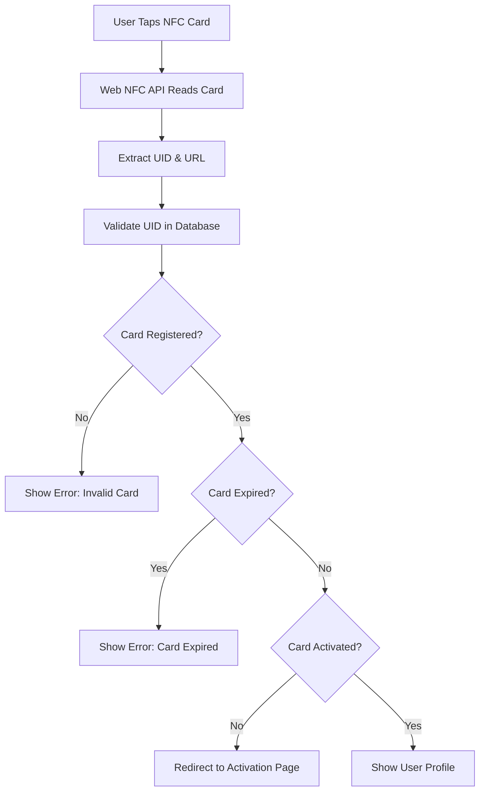

# GoTapMode Frontend

A Vue.js 3 frontend application for the GoTapMode NFC card management system. This frontend provides both user and admin interfaces for NFC card interaction, profile management, and administrative controls.

## 🚀 Features

- **📱 NFC Card Reading**: Web NFC API integration for card validation and reading
- **👤 User Interface**: Complete user profile management and card activation
- **👨‍💼 Admin Panel**: Administrative interface for card creation and user management
- **🎨 Modern UI**: Responsive design with Tailwind CSS
- **⚡ Real-time Validation**: Instant card validation with UID verification
- **🔐 Secure Authentication**: JWT-based authentication for users and admins
- **🛡️ Tamper Detection**: Validates card UID against database to prevent tampering

## 🛠️ Tech Stack

- **Framework**: Vue.js 3 with Composition API
- **Build Tool**: Vite for fast development and building
- **Styling**: Tailwind CSS for modern, responsive design
- **Routing**: Vue Router for single-page application navigation
- **HTTP Client**: Axios for API communication
- **NFC**: Web NFC API for browser-based card interaction
- **Icons**: Custom NFC and UI icons

## 📁 Project Structure

```
frontend/
├── src/
│   ├── admin/              # Admin components
│   │   ├── Dashboard.vue
│   │   ├── NFCWriting.vue
│   │   ├── UserManagement.vue
│   │   └── ...
│   ├── user/               # User components
│   │   ├── CardValidation.vue
│   │   ├── PublicProfile.vue
│   │   ├── EditProfile.vue
│   │   ├── Signup.vue
│   │   ├── Activate.vue
│   │   └── ...
│   ├── components/         # Shared components
│   │   └── ProfileForm.vue
│   ├── config/             # Configuration files
│   │   └── api.js
│   ├── router/             # Vue Router configuration
│   │   └── index.js
│   ├── utils/              # Utility functions
│   │   └── helpers.js
│   ├── App.vue             # Main application component
│   ├── main.js             # Application entry point
│   └── style.css           # Global styles
├── public/
│   ├── icons/              # NFC and UI icons
│   └── logo/               # Application logo
├── dist/                   # Build output
├── package.json
├── vite.config.js
├── tailwind.config.js
└── postcss.config.js
```

## 🎯 Key Components

### User Components
- **`CardValidation.vue`** - NFC card reading and validation with UID verification
- **`PublicProfile.vue`** - User profile display with contact information
- **`EditProfile.vue`** - Profile editing interface with image upload
- **`Signup.vue`** - User registration and account creation
- **`Activate.vue`** - Card activation flow and validation
- **`UserLogin.vue`** - User authentication interface

### Admin Components
- **`NFCWriting.vue`** - NFC card writing interface with URL generation
- **`UserManagement.vue`** - User administration and management
- **`Dashboard.vue`** - Admin dashboard with statistics
- **`AdminLogin.vue`** - Admin authentication interface

### Shared Components
- **`ProfileForm.vue`** - Reusable profile form component
- API configuration and utility functions

## 📱 NFC Features

### Card Reading
- **UID Capture**: Reads unique card identifier from NFC hardware
- **URL Reading**: Extracts activation code from card's NDEF records
- **Dual Validation**: Validates both UID and activation code for security

### Card Writing (Admin)
- **URL Generation**: Creates unique URLs for card activation
- **NDEF Writing**: Writes URL records to NFC cards
- **Overwrite Support**: Allows updating existing cards

### Security Features
- **Tamper Detection**: Validates card UID against database
- **Expiry Checking**: Verifies card expiration dates
- **Activation Status**: Checks if cards are properly activated

## 🚀 Installation

### Prerequisites
- Node.js 18+ 
- npm or yarn
- NFC-enabled device (for testing)

### Setup

1. **Clone the repository**
   ```bash
   git clone https://github.com/akihiko403/GoTapMode-Frontend.git
   cd GoTapMode-Frontend
   ```

2. **Install dependencies**
   ```bash
   npm install
   ```

3. **Environment configuration**
   ```bash
   cp .env.example .env
   ```

4. **Configure environment variables**
   ```env
   VITE_API_BASE=https://your-api-domain.com/api
   VITE_FRONTEND_BASE=https://GoTapMode.info
   ```

5. **Start development server**
   ```bash
   npm run dev
   ```

6. **Build for production**
   ```bash
   npm run build
   ```

## 🔧 Development

### Available Scripts

- **`npm run dev`** - Start development server with hot reload
- **`npm run build`** - Build for production
- **`npm run preview`** - Preview production build locally
- **`npm run lint`** - Run ESLint for code quality

### Development Server

The development server runs on `http://localhost:5173` by default with:
- Hot module replacement (HMR)
- Fast refresh for Vue components
- Automatic browser reload on changes

## 🌐 NFC Card Flow



## 🔐 Authentication

### User Authentication
- JWT token-based authentication
- Secure login/logout functionality
- Protected routes for authenticated users

### Admin Authentication
- Separate admin authentication system
- Role-based access control
- Admin-only routes and components

## 🎨 Styling

### Tailwind CSS
- Utility-first CSS framework
- Responsive design system
- Custom color palette for GoTapMode branding
- Dark/light mode support (configurable)

### Custom Components
- Reusable UI components
- Consistent design system
- Mobile-first responsive design

## 🌐 Browser Compatibility

| Browser | NFC Support | Status |
|---------|-------------|---------|
| Chrome/Edge | ✅ Full | Recommended |
| Firefox | ⚠️ Limited | Partial support |
| Safari | ❌ None | Fallback mode |

### Fallback Handling
- Graceful degradation for non-NFC browsers
- Manual activation code entry
- Clear error messages and instructions

## 📱 Mobile Support

- **Responsive Design**: Works on all screen sizes
- **Touch-Friendly**: Optimized for mobile interactions
- **PWA Ready**: Can be configured as Progressive Web App
- **NFC Support**: Full NFC functionality on supported mobile devices

## 🔧 Configuration

### API Configuration
The frontend communicates with the Laravel backend through the API configuration in `src/config/api.js`:

```javascript
// API base URL configuration
const DEFAULT_BASE = 'https://your-api-domain.com/api';
export const BACKEND_BASE = import.meta.env.VITE_API_BASE || DEFAULT_BASE;

// Frontend base URL for NFC cards
const DEFAULT_FRONTEND_BASE = 'https://GoTapMode.info';
export const FRONTEND_BASE = import.meta.env.VITE_FRONTEND_BASE || DEFAULT_FRONTEND_BASE;
```

### Environment Variables
- `VITE_API_BASE` - Backend API base URL
- `VITE_FRONTEND_BASE` - Frontend base URL for NFC card URLs

## 🚀 Deployment

### Production Build
```bash
npm run build
```

### Deployment Options
- **Static Hosting**: Deploy `dist/` folder to any static host
- **CDN**: Use CDN for faster global delivery
- **Docker**: Containerize the application
- **Vercel/Netlify**: One-click deployment platforms

### Build Optimization
- Code splitting for faster loading
- Tree shaking to remove unused code
- Asset optimization and compression
- Modern JavaScript for better performance

## 🧪 Testing

### Manual Testing
- NFC card reading and writing
- User authentication flows
- Admin panel functionality
- Responsive design across devices

### Browser Testing
- Chrome/Edge (full NFC support)
- Firefox (limited NFC support)
- Mobile browsers with NFC

## 📊 Performance

### Optimization Features
- **Vite Build Tool**: Fast development and optimized builds
- **Code Splitting**: Lazy loading for better performance
- **Asset Optimization**: Compressed images and assets
- **Modern JavaScript**: ES6+ features for better performance

## 🔒 Security

### Frontend Security
- JWT token storage in localStorage
- Secure API communication
- Input validation and sanitization
- XSS protection through Vue.js

### NFC Security
- UID validation against database
- Activation code verification
- Tamper detection and prevention

## 📞 Support

For technical support or questions about the GoTapMode frontend:

- Check the browser console for error messages
- Ensure NFC is enabled on your device
- Verify API connectivity and configuration
- Contact the development team for assistance

## 📄 License

This project is proprietary software. All rights reserved.

---

**GoTapMode Frontend** - Modern NFC card management with Vue.js 3 and Web NFC API.
